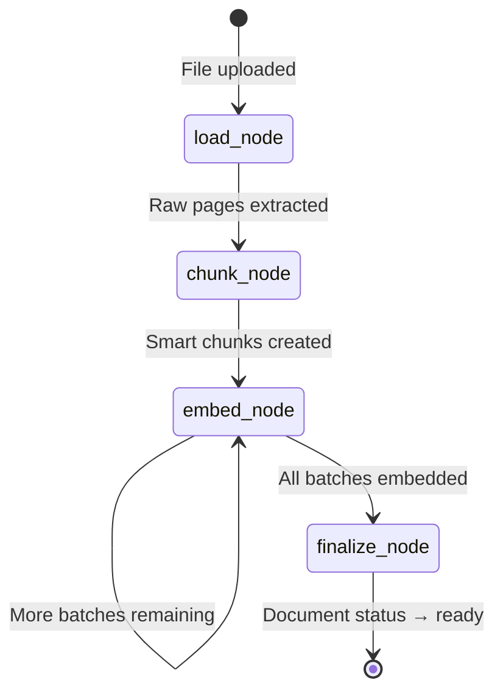
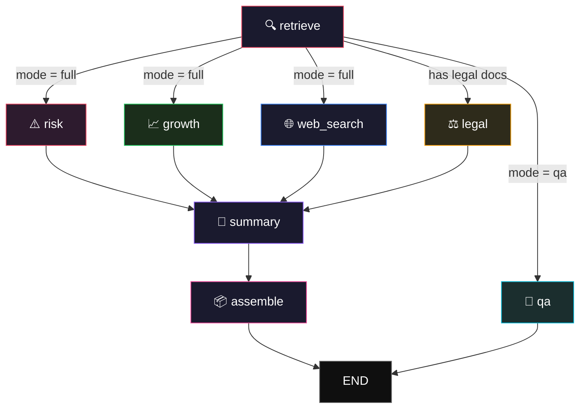

<p align="center">
  
  
  
  
</p>

# DiligenceAI

**AI-powered due diligence platform that reads your data room so you don't have to.**

DiligenceAI is a full-stack RAG (Retrieval-Augmented Generation) application that ingests financial, legal, and corporate documents, then deploys four specialised AI agents in parallel to produce a comprehensive due diligence report — complete with risk flags, growth signals, legal clause analysis, and an executive summary with source citations.

---

## Table of Contents

- [Features](#features)
- [Architecture Overview](#architecture-overview)
- [LangGraph Pipeline — Deep Dive](#langgraph-pipeline--deep-dive)
  - [Ingestion Graph](#1-ingestion-graph)
  - [Analysis Graph](#2-analysis-graph)
  - [State Schema](#state-schema)
  - [Node Descriptions](#node-descriptions)
  - [Edge Logic](#edge-logic--conditional-routing)
- [Tech Stack](#tech-stack)
- [Project Structure](#project-structure)
- [Getting Started](#getting-started)
  - [Prerequisites](#prerequisites)
  - [Backend Setup](#backend-setup)
  - [Frontend Setup](#frontend-setup)
  - [Database Setup](#database-setup)
- [Environment Variables](#environment-variables)
- [API Reference](#api-reference)
- [Observability](#observability)
- [Screenshots](#screenshots)
- [License](#license)

---

## Features

| Capability | Description |
|---|---|
| **Multi-Agent Analysis** | Four specialised LangGraph nodes (Risk, Growth, Legal, Summary) execute in parallel |
| **Document Ingestion** | Upload PDF, DOCX, XLSX, TXT — auto-chunked and vector-embedded via ChromaDB |
| **RAG Q&A Chat** | Conversational interface with retrieval-augmented answers and source citations |
| **Web Search Agent** | External search node enriches analysis with real-time market context |
| **Executive Report** | Auto-generated DOCX report with charts, risk matrix, and formatted sections |
| **Real-time Streaming** | SSE-based streaming for both chat responses and analysis progress |
| **LangSmith Observability** | Full tracing of every LLM call, retrieval, and graph execution |
| **Auth & RLS** | Google OAuth via Supabase with Row Level Security on every table |
| **3-Pane Command Center** | Chat + Document Viewer + Report Editor in a single workspace |

---

## Architecture Overview

```
┌─────────────────────────────────────────────────────────────────┐
│                        Frontend (React + Vite)                  │
│  ┌──────────┐   ┌──────────────┐   ┌──────────────────────┐    │
│  │   Chat   │   │  PDF Viewer  │   │  Report / Analysis   │    │
│  │Interface │   │   (iframe)   │   │      Editor          │    │
│  └────┬─────┘   └──────┬───────┘   └──────────┬───────────┘    │
│       │                │                       │               │
│       └────────────────┼───────────────────────┘               │
│                        │  Axios + SSE (JWT Auth)               │
└────────────────────────┼───────────────────────────────────────┘
                         │
┌────────────────────────┼───────────────────────────────────────┐
│                  FastAPI Backend (Python)                       │
│                        │                                       │
│  ┌─────────────────────┼─────────────────────────────────┐     │
│  │              API Layer (REST + SSE)                    │     │
│  │  /auth  /sessions  /upload  /analyze  /ask  /documents│     │
│  └─────────────────────┬─────────────────────────────────┘     │
│                        │                                       │
│  ┌─────────────────────┼─────────────────────────────────┐     │
│  │          LangGraph Orchestration Engine                │     │
│  │                                                       │     │
│  │  ┌──────────┐    ┌──────┐┌───────┐┌───────┐          │     │
│  │  │ Retrieve │───▶│ Risk ││Growth ││ Legal │ (parallel)│     │
│  │  └──────────┘    └──┬───┘└──┬────┘└──┬────┘          │     │
│  │                     └───────┼────────┘               │     │
│  │                             ▼                         │     │
│  │                      ┌──────────┐                     │     │
│  │                      │ Summary  │                     │     │
│  │                      └────┬─────┘                     │     │
│  │                           ▼                           │     │
│  │                     ┌──────────┐                      │     │
│  │                     │ Assemble │ → Final Report       │     │
│  │                     └──────────┘                      │     │
│  └───────────────────────────────────────────────────────┘     │
│                        │                                       │
│  ┌─────────────────────┼─────────────────────────────────┐     │
│  │             Data & Storage Layer                      │     │
│  │  ChromaDB (vectors)  │  Supabase (auth + postgres)    │     │
│  │  Local FS (uploads)  │  LangSmith (observability)     │     │
│  └───────────────────────────────────────────────────────┘     │
└────────────────────────────────────────────────────────────────┘
```

---

## LangGraph Pipeline — Deep Dive

DiligenceAI uses **two distinct LangGraph state machines**:

### 1. Ingestion Graph

Triggered when a user uploads a document. Runs as a background task.



| Node | Responsibility |
|---|---|
| `load_node` | Reads PDF/DOCX/XLSX/TXT via `DocumentLoaderRouter`, extracts raw pages with metadata |
| `chunk_node` | Splits raw documents via `SmartChunker` (recursive text splitting, 1500 char / 200 overlap) |
| `embed_node` | Embeds chunks in batches of 50 into ChromaDB using `gemini-embedding-2` |
| `finalize_node` | Updates document status in Supabase, recalculates session chunk totals |

**State schema:**
```python
class IngestionState(TypedDict):
    file_path: str              # Path to uploaded file
    doc_id: str                 # Supabase document record ID
    session_id: str             # Parent session
    user_id: str                # Owner
    raw_docs: List[Document]    # Extracted pages
    chunks: List[Document]      # Split chunks
    chunk_index: int            # Current embedding batch position
    doc_type: str               # Detected document type
    page_count: int             # Total pages extracted
    error: str                  # Error message (if any)
```

### 2. Analysis Graph

The core intelligence pipeline. Triggered when the user clicks "Run Analysis".



### State Schema

```python
class DiligenceState(TypedDict):
    # Context
    session_id: str
    user_id: str
    documents_metadata: list[dict]

    # Execution control
    analysis_mode: str              # "full" | "risk_only" | "legal_only" | "qa"
    query: Optional[str]            # For Q&A mode only

    # Retrieval
    retrieved_chunks: list[Document]
    web_search_results: Optional[str]

    # Agent outputs
    risk_assessment: Optional[str]
    growth_opportunities: Optional[str]
    executive_summary: Optional[str]
    legal_analysis: Optional[str]
    qa_answer: Optional[str]

    # Tracking
    citations: list[dict]                               # [{text, source, page}]
    errors: Annotated[list[str], operator.add]           # Accumulates across nodes
    steps_completed: Annotated[list[str], operator.add]  # Progress tracking

    # Output
    final_report: Optional[dict]
```

### Node Descriptions

| Node | Agent | Model | Purpose |
|---|---|---|---|
| `retrieve` | Retriever | `gemini-embedding-2` | Parallel multi-query vector search (risk + growth + legal queries) |
| `risk` | Risk Analyst | `gemini-2.5-flash` | Identifies liabilities, regulatory exposure, litigation risk |
| `growth` | Growth Analyst | `gemini-2.5-flash` | Finds TAM expansion, revenue drivers, partnership opportunities |
| `legal` | Legal Analyst | `gemini-2.5-flash` | Reviews contract clauses, governing law, indemnification terms |
| `web_search` | Research Agent | `gemini-2.5-flash` | Searches the web for external market context and news |
| `summary` | Executive Writer | `gemini-2.5-flash` | Synthesises all agent outputs into C-suite-ready executive summary |
| `qa` | Q&A Agent | `gemini-2.5-flash` | Conversational RAG with chat history for freeform questions |
| `assemble` | — | — | Pure logic node — combines all outputs into `final_report` dict |

### Edge Logic & Conditional Routing

```python
def route_after_retrieve(state) -> list[str]:
    mode = state["analysis_mode"]

    if mode == "qa":     return ["qa"]        # Direct to Q&A
    if mode == "risk_only": return ["risk"]   # Single agent
    if mode == "legal_only": return ["legal"] # Single agent

    # Full analysis — parallel fan-out
    targets = ["risk", "growth", "web_search"]
    if any(d["doc_type"] == "legal_contract" for d in state["documents_metadata"]):
        targets.append("legal")              # Conditional legal agent
    return targets
```

**Key design decisions:**
- **Parallel fan-out**: Risk, Growth, and Web Search run simultaneously after retrieval
- **Conditional legal**: The legal agent only activates if legal documents are detected
- **Accumulating state**: `errors` and `steps_completed` use `operator.add` annotation for safe parallel writes
- **Keyword filtering**: Each agent receives chunks pre-filtered to its domain (risk keywords, growth keywords, etc.)

---

## Tech Stack

| Layer | Technology |
|---|---|
| **LLM** | Google Gemini 2.5 Flash |
| **Embeddings** | Gemini Embedding 2 (`models/gemini-embedding-2`) |
| **Orchestration** | LangGraph (StateGraph with parallel fan-out) |
| **Observability** | LangSmith (full trace of every run) |
| **Vector Store** | ChromaDB (persistent, per-session collections) |
| **Backend** | FastAPI + Uvicorn |
| **Database** | Supabase (PostgreSQL + Auth + RLS) |
| **Frontend** | React 18 + Vite + TailwindCSS |
| **Document Gen** | python-docx + matplotlib (DOCX report with charts) |
| **Streaming** | SSE (Server-Sent Events) via `sse-starlette` |

---

## Project Structure

```
diligenceai/
├── backend/
│   ├── api/                    # FastAPI route handlers
│   │   ├── auth.py             # Google OAuth + JWT validation
│   │   ├── auth_middleware.py   # Bearer token dependency
│   │   ├── sessions.py         # CRUD for diligence sessions
│   │   ├── upload.py           # Multipart file upload + async ingestion
│   │   ├── analyze.py          # Trigger analysis + SSE progress + DOCX export
│   │   ├── ask.py              # RAG Q&A with SSE streaming
│   │   └── documents.py        # Document listing + PDF viewer
│   │
│   ├── chains/                 # LangChain prompt chains (one per agent)
│   │   ├── retrieval.py        # Multi-query + single-query vector retrieval
│   │   ├── risk_chain.py       # Risk assessment prompt + Gemini call
│   │   ├── growth_chain.py     # Growth analysis prompt + Gemini call
│   │   ├── legal_chain.py      # Legal clause review prompt + Gemini call
│   │   ├── summary_chain.py    # Executive summary synthesis
│   │   ├── qa_chain.py         # Conversational RAG with chat history
│   │   └── web_search_chain.py # Web search agent chain
│   │
│   ├── graph/                  # LangGraph state machines
│   │   ├── state.py            # DiligenceState TypedDict
│   │   ├── nodes.py            # All graph node functions
│   │   ├── edges.py            # Conditional routing logic
│   │   ├── pipeline.py         # Graph compilation + run_pipeline()
│   │   └── ingestion_graph.py  # Document ingestion state machine
│   │
│   ├── ingestion/              # Document processing pipeline
│   │   ├── loader.py           # PDF/DOCX/XLSX/TXT loader with type detection
│   │   ├── chunker.py          # Smart recursive text splitter
│   │   ├── embedder.py         # Gemini embedding wrapper
│   │   └── vectorstore.py      # ChromaDB manager (per-session collections)
│   │
│   ├── models/                 # Pydantic request/response models
│   ├── utils/                  # Helpers (citations, DOCX builder)
│   │   ├── citations.py        # Extract citations from retrieved chunks
│   │   └── document_builder.py # Beautiful DOCX report generator
│   │
│   ├── config.py               # Pydantic Settings (env-driven config)
│   ├── database.py             # Supabase client factory
│   ├── observability.py        # LangSmith callback setup
│   └── main.py                 # FastAPI app entry point
│
├── frontend/
│   ├── src/
│   │   ├── components/         # Reusable UI components
│   │   │   ├── ChatInterface.jsx
│   │   │   ├── AnalysisPanel.jsx
│   │   │   ├── AnalysisInsights.jsx
│   │   │   ├── DocumentUploader.jsx
│   │   │   ├── DocumentList.jsx
│   │   │   ├── ReportSection.jsx
│   │   │   ├── CitationCard.jsx
│   │   │   └── charts.jsx
│   │   │
│   │   ├── pages/              # Route-level pages
│   │   │   ├── Landing.jsx     # Marketing landing page
│   │   │   ├── Login.jsx       # Google OAuth login
│   │   │   ├── Dashboard.jsx   # Session management
│   │   │   └── Session.jsx     # 3-pane workspace
│   │   │
│   │   ├── hooks/              # Custom React hooks
│   │   │   ├── useUpload.js    # File upload state
│   │   │   ├── useAnalysis.js  # Analysis SSE streaming
│   │   │   └── useChat.js      # Chat SSE streaming
│   │   │
│   │   ├── lib/                # Utilities
│   │   │   ├── api.js          # Axios instance + JWT interceptor
│   │   │   └── supabase.js     # Supabase client
│   │   │
│   │   ├── App.jsx             # React Router setup
│   │   ├── main.jsx            # Entry point
│   │   └── index.css           # Design system (TailwindCSS tokens)
│   │
│   └── public/
│       └── handshake-bg.png    # Login page hero image
│
├── supabase/
│   └── migration.sql           # Full schema + RLS policies
│
├── requirements.txt            # Python dependencies
├── .env.example                # Environment variable template
└── DESIGN.md                   # UI design system specification
```

---

## Getting Started

### Prerequisites

- **Python 3.11+**
- **Node.js 18+**
- **Supabase account** (free tier works)
- **Google AI API key** ([Get one here](https://makersuite.google.com/app/apikey))
- **LangSmith account** (optional, for tracing — [Sign up](https://smith.langchain.com))

### Backend Setup

```bash
cd diligenceai

# Create virtual environment
python -m venv venv
source venv/bin/activate  # or .\venv\Scripts\activate on Windows

# Install dependencies
pip install -r requirements.txt

# Configure environment
cp .env.example .env
# Edit .env with your API keys (see Environment Variables section)

# Start the server
uvicorn backend.main:app --reload --port 8000
```

### Frontend Setup

```bash
cd diligenceai/frontend

# Install dependencies
npm install

# Start dev server
npm run dev
```

The app will be available at `http://localhost:5173`.

### Database Setup

1. Create a new project on [Supabase](https://supabase.com)
2. Go to **SQL Editor** and run the contents of `supabase/migration.sql`
3. Enable **Google OAuth** in Authentication → Providers
4. Copy your project URL, anon key, and service role key into `.env`

---

## Environment Variables

Create a `.env` file in the `diligenceai/` root:

```env
# Google Gemini
GOOGLE_API_KEY=your_gemini_api_key

# LangSmith (optional but recommended)
LANGCHAIN_TRACING_V2=true
LANGCHAIN_ENDPOINT=https://api.smith.langchain.com
LANGCHAIN_API_KEY=your_langsmith_api_key
LANGCHAIN_PROJECT=DiligenceAI

# Embeddings
GEMINI_EMBEDDING_MODEL=models/gemini-embedding-2

# Supabase
SUPABASE_URL=https://your-project.supabase.co
SUPABASE_ANON_KEY=your_anon_key
SUPABASE_SERVICE_ROLE_KEY=your_service_role_key

# Vector Store
CHROMA_PERSIST_DIR=./data/chroma

# App
UPLOAD_DIR=./data/uploads
MAX_FILE_SIZE_MB=50
```

For the frontend, create `frontend/.env`:
```env
VITE_SUPABASE_URL=https://your-project.supabase.co
VITE_SUPABASE_ANON_KEY=your_anon_key
```

---

## API Reference

| Method | Endpoint | Auth | Description |
|---|---|---|---|
| `POST` | `/api/auth/signup` | ✗ | Create account |
| `POST` | `/api/auth/login` | ✗ | Email/password login |
| `POST` | `/api/sessions` | ✔ | Create new diligence session |
| `GET` | `/api/sessions` | ✔ | List user's sessions |
| `GET` | `/api/sessions/:id` | ✔ | Get session details |
| `POST` | `/api/sessions/:id/upload` | ✔ | Upload documents (multipart) |
| `GET` | `/api/sessions/:id/documents` | ✔ | List session documents |
| `GET` | `/api/sessions/:id/documents/:docId/view` | ✔ | Stream PDF for viewer |
| `GET` | `/api/sessions/:id/analyze` | ✔ | Trigger analysis (SSE stream) |
| `GET` | `/api/sessions/:id/report` | ✔ | Get saved report |
| `GET` | `/api/sessions/:id/download-report` | ✔ | Download DOCX report |
| `POST` | `/api/sessions/:id/ask` | ✔ | Ask a question (SSE stream) |
| `GET` | `/api/sessions/:id/chat-history` | ✔ | Get chat history |
| `GET` | `/api/health` | ✗ | Health check |

---

## Observability

DiligenceAI is fully instrumented with **LangSmith**:

- Every LangGraph run is traced end-to-end
- Individual chain calls (risk, growth, legal, summary) are nested spans
- Retrieval queries and embedding calls are tracked
- Token usage and latency are recorded per node

Set `LANGCHAIN_TRACING_V2=true` and provide your `LANGCHAIN_API_KEY` to enable tracing. View traces at [smith.langchain.com](https://smith.langchain.com).

---

## Screenshots

> Screenshots will be added after deployment.

---

## License

This project is built for educational and demonstration purposes. All rights reserved.

---

<p align="center">
  <sub>Built with ❤️ using Gemini, LangGraph, Supabase, and React</sub>
</p>
